# Model audit: guns and zombies

Audited 2026-09-15. Every gun and both zombie models were rendered alone with
the game's own build code — `buildViewmodel()` for the 29 archive guns,
`ZombieVisual` plus `attachZombieDetail()` for the zombies — from fixed angles
under flat studio light, so defects in the geometry itself are visible instead
of being lost in the map's night lighting.

The zombie renders use flat clay colours so it is obvious what clips into what:

| Colour | Piece |
| --- | --- |
| orange | torn tunic (`Torso` detail) |
| green | coat skirt (`Hips` detail) |
| blue | shoulder rags (`ShoulderL` / `ShoulderR` detail) |
| red | head damage (`Head` detail) |
| yellow | glowing eyes |

The "x-ray" render makes every surface translucent to show what is buried.
Line numbers refer to the code at the time of the audit.

## Summary

| Model | Problem | Code |
| --- | --- | --- |
| Kar98k, Gewehr 43, M1A1, M1 Garand, Mosin-Nagant, Springfield | Stock renders as a hollow frame of thin strips | self-crossing stock outlines, `js/weapons.js:1238`, `:1297`, `:1334`, `:1369`, `:1496` |
| Springfield | Same model as the Mosin-Nagant; only the bolt handle angle differs | `js/weapons.js:1493-1494` |
| Thompson | Drum face ring turned 90°: a hoop through the drum and both sides of the receiver | `js/weapons.js:1000` |
| PPSh-41 | Same 90° turn on both drum rings; drum latch block floats off to one side | `js/weapons.js:1068-1069`, `:1072` |
| Panzerschreck | Loaded warhead is wider than the tube and shows through its wall | |
| Double-barrel | Forend hangs below the barrels; square port on a break-action receiver | |
| MP40 | Barrel rings far wider than the barrel, hanging loose | |
| M1911 | Grip panel stops short of the frame | |
| Zombie (Basic) | Glowing eyes buried inside the head, down by the nose | `js/zombies.js:313` |
| Zombie (both) | Head damage (variants 1, 3, 4, 7) buried inside the head | `js/render/ZombieDetail.js:273`, `:392` |
| Zombie (both) | Tunic: buried in the Basic's torso; a sail off the Chubby's back | `js/render/ZombieDetail.js:217`, `:395` |
| Zombie (both) | Skirt swallowed by the model's own shorts; a floating ring when crawling | `js/render/ZombieDetail.js:180`, `:388` |
| Zombie (both) | Shoulder rags buried inside the upper arms | `js/render/ZombieDetail.js:390` |

## Guns

### Hollow stocks — Kar98k, Gewehr 43, M1A1, M1 Garand, Mosin-Nagant, Springfield

The worst defect in the set. Each of these stocks is built by `profileZY()` from
an outline whose top and bottom edges cross each other at the wrist. A shape
that crosses itself cannot be filled, so the stock renders as an empty frame of
thin strips: receivers and magazines float over open air, and on the Gewehr 43
the trigger pieces hang in the gap. All 96 literal outlines in `js/weapons.js`
were checked for self-crossing; these five are the only ones:

- `kar98_stock` — `js/weapons.js:1238`
- `g43_stock` — `js/weapons.js:1297`
- `m1a1_stock` — `js/weapons.js:1334` (what reads as a folding stock is this bug)
- `garand_stock` — `js/weapons.js:1369`
- `id + '_stock'` — `js/weapons.js:1496`, shared by the Mosin-Nagant and Springfield

Kar98k:

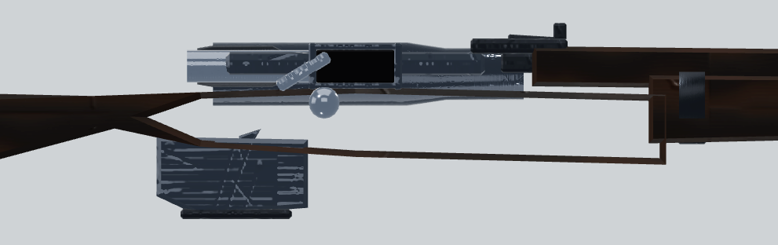

Gewehr 43:

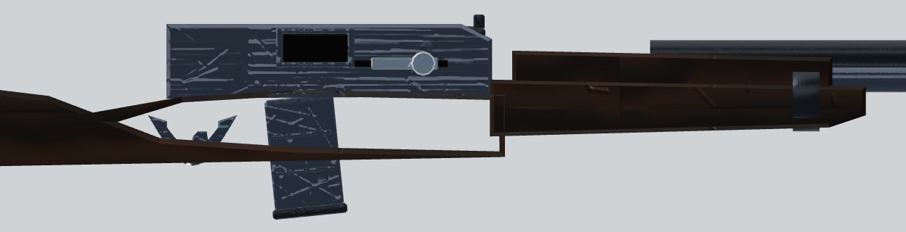

M1 Garand:

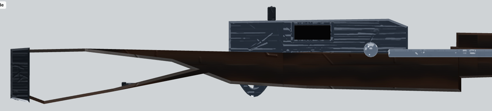
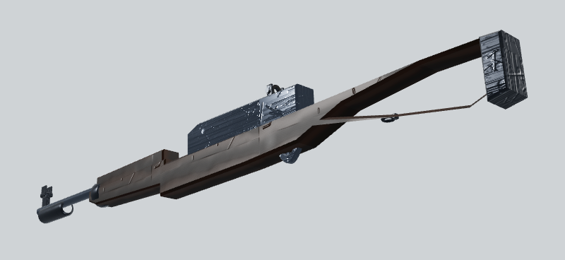

M1A1 Carbine:

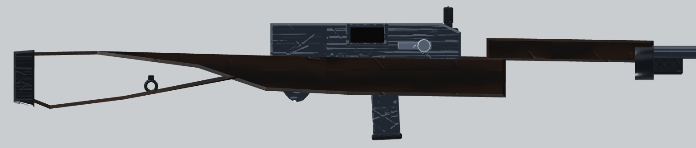

Mosin-Nagant — the scope's front mount also stands on nothing, and no trigger
guard is visible:

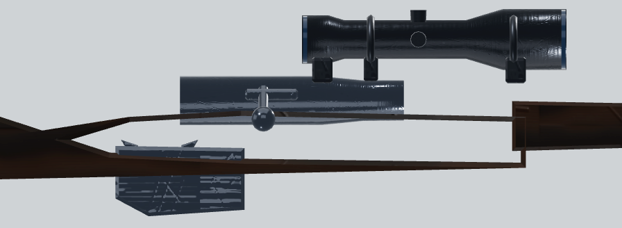

### Springfield is the Mosin-Nagant

Both are built by one branch (`js/weapons.js:1493-1494`); the only difference is
the bolt handle's angle and knob position.

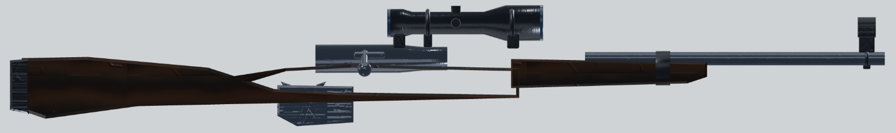

### Thompson — drum ring turned a quarter-turn

The drum's face ring (`torusGeo` at `js/weapons.js:1000`) is rotated 90° off the
drum face, so it stands through the drum — edge-on it reads as a bar across the
drum, and from above it is a hoop sticking out of both sides of the receiver.
The drum also sits partly inside the receiver, with the trigger-guard strut
passing through it.

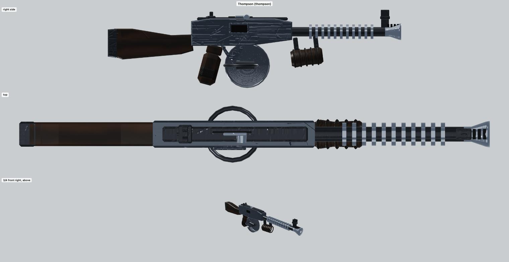
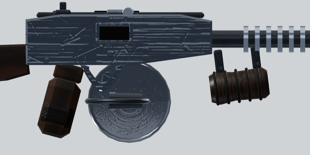
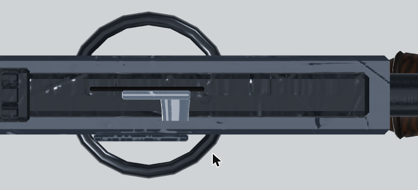

### PPSh-41 — same drum bug, twice

Both drum rings (`js/weapons.js:1068-1069`) have the Thompson's 90° turn, and
the block meant to join the drum to the gun (`js/weapons.js:1072`) sits off to
one side.

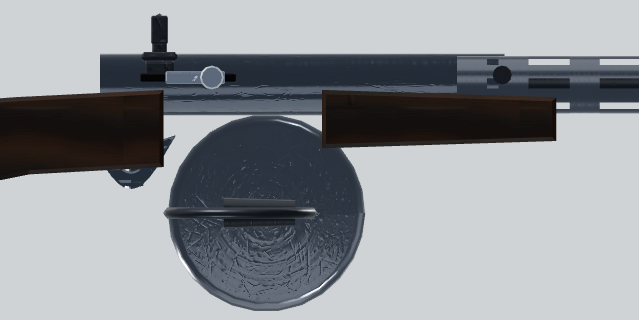
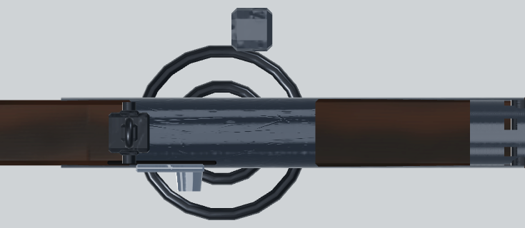
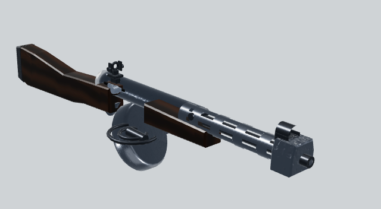

### Panzerschreck — warhead through the tube

The loaded warhead is wider than the tube and renders through the tube wall;
the rocket's body and fins stick out of the back.

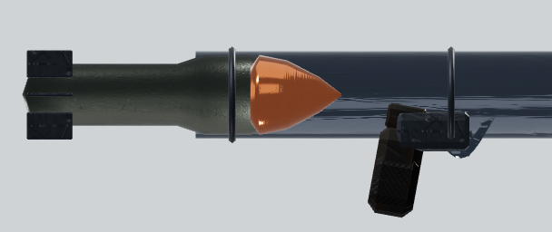
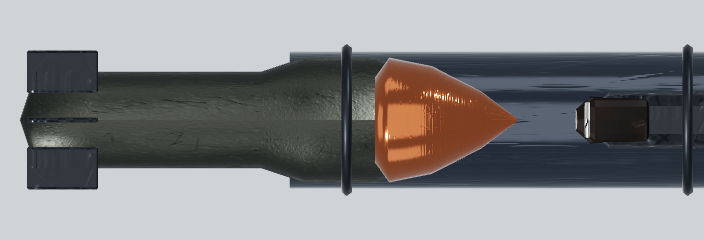

### Double-barrel shotgun — floating forend

The forend hangs below the barrels with a visible gap, and the break-action
receiver has a square black port it should not have.

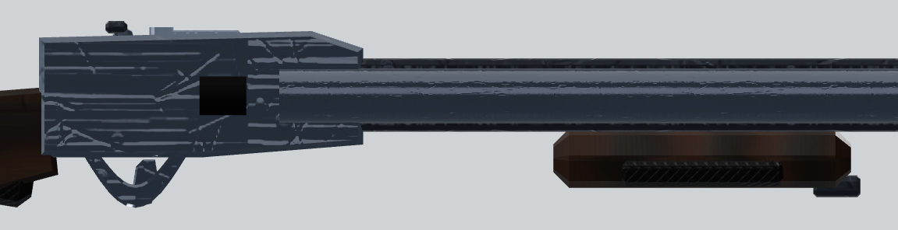

### MP40 — loose barrel rings

The two rings on the barrel are far wider than the barrel and hang around it
like loose hoops.

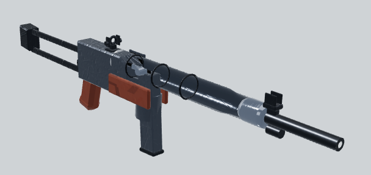

### M1911 — grip gap (minor)

The grip panel stops short of the frame.

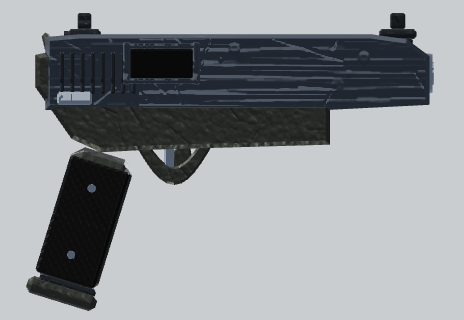

### Minor, not photographed

- .357 Magnum: the ejector rod runs under the barrel with a hairline gap.
- Type 100: the magazine juts out to the right of the receiver.

### No problems found

M1897 Trench Gun, STG-44, FG42, BAR, MG42, Browning M1919, PTRS-41, Ray Gun,
UMP45, ACR, FAMAS, AK-74u, Galil, Commando, Wunderwaffe DG-2.

## Zombies

All five problems come from how the eyes and damage detail are attached, not
from the zombie models themselves.

### Glowing eyes buried — Basic zombie

The eye meshes are placed on the head bone at a fixed offset
(`js/zombies.js:313`) that lands inside the Basic zombie's head, down by the
nose, well below the eye sockets. They only show on the Chubby.

### Head damage buried — both models

The cheekbone and bare-skull patches that damage variants 1, 3, 4 and 7 add
(`js/render/ZombieDetail.js:273`, mounted at `:392`) sit inside the head next
to the eyes and never show.

### Tunic the wrong size — both models

The torn tunic (`js/render/ZombieDetail.js:217`, mounted at `:395`) does not fit
either body. On the Basic zombie it is a tube buried inside the torso, so only a
strip shows on the chest and the back is bare. On the Chubby it flares off the
back like a sail, above and behind the shoulders.

### Skirt swallowed — both models

The coat skirt (`js/render/ZombieDetail.js:180`, mounted at `:388`) sits inside
the model's own shorts; scraps poke through between and behind the legs. In the
crawl pose it floats as a ring over the zombie's back.

### Shoulder rags buried — both models

The sleeve tatters (`js/render/ZombieDetail.js:390`) are inside the upper arms
and never show.

Basic zombie, normal render — no eyes, a front-only tunic, skirt scraps:

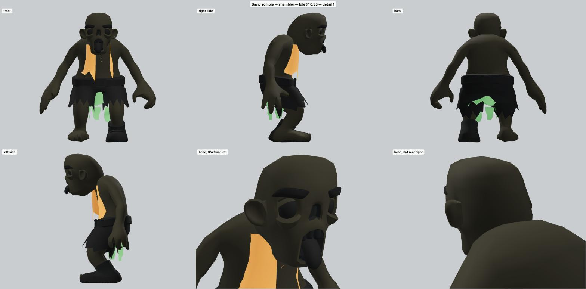

Basic zombie, x-ray — eyes (yellow) and head damage (red) inside the face, the
tunic tube (orange) inside the torso, the skirt ring (green) inside the shorts,
the shoulder rags (blue) inside the arms:

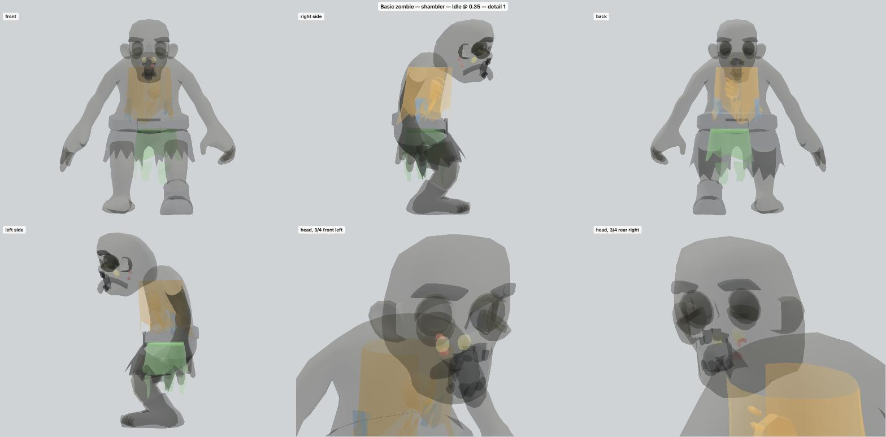

Chubby zombie tearing at a barricade — the tunic sail:

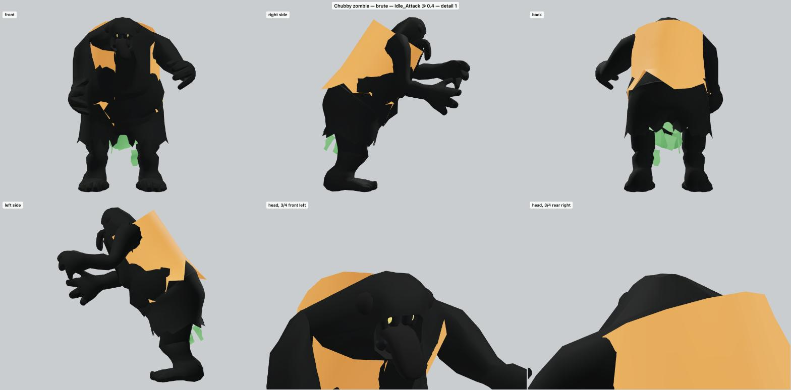

Crawling — the skirt ring over the back:

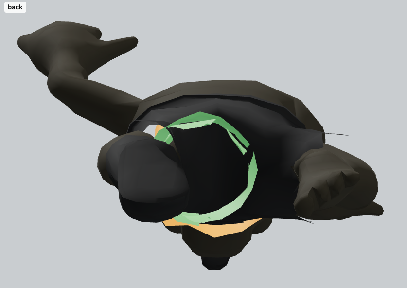
